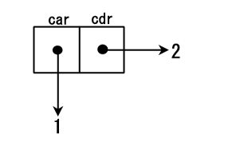
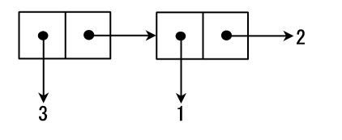
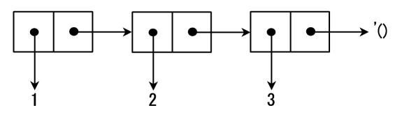

# Scheme

## 配置环境
#### 安装
``` sh
sudo apt-get install mit-scheme

# Mac
brew install mit-scheme
```

#### 使用
- 进入 repl：在终端输入 ```mit-scheme``` 或 ```scheme```
- 执行程序：```scheme < test.scm```
- 退出 repl：在终端输入 ```(quit)```

## 语法
### 四种基本算术操作
形如这些由括号、标记（token）以及分隔符组成的式子，被称为S-表达式。

+、-、*和/分别代表加、减、乘、除。这些函数都接受任意多的参数。
``` scheme
(- 10 3)    ;→ 7
(- 10 3 5)  ;→ 2
(* 2 3)     ;→ 6
(* 2 3 4)   ;→ 24
(/ 29 3)    ;→ 29/3
(/ 29 3 7)  ;→ 29/21
(/ 9 6)     ;→ 3/2
(* (+ 2 3) (- 5 3)) ;→ 10
(/ (+ 9 1) (+ 2 3)) ;→ 2
```

Scheme（以及大多数Lisp方言）都可以处理分数。

函数exact->inexact 用于把分数转换为浮点数。Scheme也可以处理复数。复数是形如a+bi的数，此处a称为实部，b称为虚部。

``` scheme
(exact->inexact (/ 29 3 7)) ;→ 1.380952380952381
```

### 其它算术操作
#### quotient，remainder，modulo和sqrt
- 函数`quotient`用于求商数（quotient）。
- 函数`remainder`和modulo用于求余数（remainder）。
- 函数`sqrt`用于求参数的平方根（square root）。

``` scheme
(quotient 7 3) ;→ 2
(modulo 7 3)   ;→ 1
(sqrt 8)       ;→ 2.8284271247461903
```

#### 三角函数
数学上的三角函数，诸如sin，cos，tan，asin，acos和atan都可以在Scheme中使用。atan接受1个或2个参数。如果atan的参数为1/2 π，那么就要使用两个参数来计算。

``` scheme
(atan 1)   ;→ 0.7853981633974483
(atan 1 0) ;→ 1.5707963267948966
```

#### 指数和对数
指数通过exp函数运算，对数通过log函数运算。a的b次幂可以通过(expt a b)来计算。

### Cons单元和表

#### Cons单元
Cons单元是一个存放了两个地址的内存空间。Cons单元的本质就是一个内存空间。Cons单元可用函数cons生成。

``` scheme
(cons 1 2)
;Value 2: (1 . 2)
```

函数`cons`给两个地址分配了内存空间，并把存放指向`1`的地址放在一个空间，把存放指向`2`的地址放在另一个空间。



存放指向`1`的地址的内存空间被称作`car`部分，对应的，存放指向`2`的地址的内存空间被称作`cdr`部分。`car`和`cdr`分别是寄存器地址部分（Contents of the Address part of the Register）和寄存器减量部分（Contents of the Decrement part of the Register）的简称。

Cons单元也可以被串起来。

``` scheme
(cons 3 (cons 1 2))
;Value 3: (3 1 . 2)
```



#### 表
表是`Cons`单元通过用cdr部分连接到下一个`Cons`单元的开头实现的。表中包含的’()被称作空表。就算数据仅由一个Cons单元组成，只要它的cdr单元是’()，那它就是一个表。

表(1 2 3)的内存结构：


### 引用
一个被称为引用（quote）的形式可以用来阻止记号被求值。它是用来将符号或者表原封不动地传递给程序，而不是求值后变成其它的东西。

比如：
- `’(+ 2 3)`代表列表`(+ 2 3)`本身；
- `’+`代表符号`+`本身；

### car函数和cdr函数
返回一个Cons单元的car部分和cdr部分的函数分别是car和cdr函数。如果cdr部分串连着Cons单元，解释器会打印出整个cdr部分。

### list函数
`list`函数使得我们可以构建包含数个元素的表。函数`list`有任意个数的参数，且返回由这些参数构成的表。

### 函数
使用`define`来将一个符号与一个值绑定。你可以通过这个操作符定义例如数、字符、表、函数等任何类型的全局参数。

``` scheme
(define sum3
  (lambda (a b c)
    (+ a b c)))

(define (sum3 a b c)
  (+ a b c))
```

### if表达式
if的格式如下：
``` 
(if predicate then_value else_value)
```

如果`predicate`部分为真，那么`then_value`部分被求值，否则`else_value`部分被求值，并且求得的值会返回给`if`语句的括号外。`true`是除`false`以外的任意值，`true`使用`#t`表示，`false`用`#f`表示。

`then_value`和`else_value`都应该是S-表达式。

### and
`and`具有任意个数的参数，并从左到右对它们求值。如果某一参数为`#f`，那么它就返回`#f`，而不对剩余参数求值。反过来说，如果所有的参数都不是`#f`，那么就返回最后一个参数的值。

``` scheme
(and #f 0)
;Value: ()

(and 1 2 3)
;Value: 3

(and 1 2 3 #f)
;Value: ()
```

### or
`or`具有可变个数的参数，并从左到右对它们求值。它返回第一个不是值`#f`的参数，而余下的参数不会被求值。如果所有的参数的值都是`#f`的话，则返回最后一个参数的值。

``` scheme
(or #f 0)
;Value: 0

(or 1 2 3)
;Value: 1

(or #f 1 2 3)
;Value: 1

(or #f #f #f)
;Value: ()
```

### cond表达式
尽管所有的分支都可以用`if`表达式表达，但当条件有更多的可能性时，你就需要使用嵌套的`if`表达式了，这将使代码变得复杂。处理这种情况可以使用`cond`表达式。`cond`表达式的格式如下：

``` scheme
(cond
  (predicate_1 clauses_1)
  (predicate_2 clauses_2)
    ......
  (predicate_n clauses_n)
  (else        clauses_else))
```
在`cond`表达式中，`predicates_i`是按照从上到下的顺序求值，而当`predicates_i`为真时，`clause_i`会被求值并返回。`i`之后的`predicates`和`clauses`不会被求值。如果所有的`predicates_i`都是假的话，则返回`cluase_else`。

### eq?、eqv?和equal?
基本函数`eq?`、`eqv?`、`equal?`具有两个参数，用于检查这两个参数是否“一致”。这三个函数之间略微有些区别。

#### eq?
该函数比较两个对象的地址，如果相同的话就返回`#t`。

#### eqv?
该函数比较两个存储在内存中的对象的类型和值。如果类型和值都一致的话就返回`#t`。

#### equal?
该函数用于比较类似于表或者字符串一类的序列。

### 用于检查数据类型的函数
- pair? 如果对象为序对则返回#t；
- list? 如果对象是一个表则返回#t。要小心的是空表’()是一个表但是不是一个序对。
- null? 如果对象是空表’()的话就返回#t。
- symbol? 如果对象是一个符号则返回#t。
- char? 如果对象是一个字符则返回#t。
- string? 如果对象是一个字符串则返回#t。
- number? 如果对象是一个数字则返回#t。
- complex? 如果对象是一个复数则返回#t。
- real? 如果对象是一个实数则返回#t。
- rational? 如果对象是一个有理数则返回#t。
- integer? 如果对象是一个整数则返回#t。
- exact? 如果对象不是一个浮点数的话则返回#t。
- inexact? 如果对象是一个浮点数的话则返回#t。

### 局部变量
使用`let`表达式可以定义局部变量。格式如下：

```
(let binds body)
```

变量在binds定义的形式中被声明并初始化。body由任意多个S-表达式构成。

``` scheme
(let ((i 1) (j 2))
  (+ i j))
;Value: 3
```

实际上，`let`表达式只是`lambda`表达式的一个语法糖：
```
(let ((p1 v1) (p2 v2) ...) exp1 exp2 ...)
;⇒
((lambda (p1 p2 ...)
  exp1 exp2 ...) v1 v2)
```
`lambda`表达式用于定义函数，它为变量建立了一个作用域。

### 递归
在自己的定义中调用自己的函数叫做递归函数（Recursive Function）。

### 尾递归
普通的递归调用并不高效因为它既浪费存储空间又具有函数调用开销。与之相反，尾递归函数包含了计算结果，当计算结束时直接将其返回。特别地，由于Scheme规范要求尾递归调用转化为循环，因此尾递归调用就不存在函数调用开销。

``` scheme
(define (fact-tail n)
  (fact-rec n n))

(define (fact-rec n p)
  (if (= n 1)
      p
      (let ((m (- n 1)))
    (fact-rec m (* p m))))
```

### letrec
letrec类似于let，但它允许一个名字递归地调用它自己。语法letrec通常用于定义复杂的递归函数。

``` scheme
(define (fact-letrec n)
  (letrec ((iter (lambda (n1 p)
    (if (= n1 1)
      p
      (let ((m (- n1 1)))
      (iter m (* p m)))))))     ; *
  (iter n n)))
```

### do表达式
语法do也可用于表达重复。它的格式如下：
```
(do binds (predicate value)
    body)
```

变量在binds部分被绑定，而如果predicate被求值为真，则函数从循环中逃逸（escape）出来，并返回值value，否则循环继续进行。

### 高阶函数
高阶函数（Higher Order Function）是一种以函数为参数的函数。它们都被用于映射（mapping）、过滤（filtering）、归档（folding）和排序（sorting）表。

Scheme中预定义函数的本质就是高阶函数，因为Scheme并没有定义块结构的语法，因此使用lambda表达式作为一个块。

### 映射
映射是将同样的行为应用于表所有元素的过程。

#### map
map过程的格式如下：
```
(map procedure list1 list2 ...)
```

procedure是个与某个过程或lambda表达式相绑定的符号。作为参数的表的个数视procedure需要的参数而定。

``` scheme
; Adding each item of '(1 2 3) and '(4 5 6).
(map + '(1 2 3) '(4 5 6))
;⇒  (5 7 9)

; Squaring each item of '(1 2 3)
(map (lambda (x) (* x x)) '(1 2 3))
;⇒  (1 4 9)
```

#### for-each
for-each的格式与map一致。但for-each并不返回一个具体的值，只是用于副作用。

``` scheme
(define sum 0)
(for-each (lambda (x) (set! sum (+ sum x))) '(1 2 3 4))
sum
;⇒  10
```

### 归档
尽管在R5RS中没有定义归档函数，但MIT-Scheme提供了reduce等函数。
```scheme
(reduce + 0 '(1 2 3 4))                 ;⇒  10
(reduce + 0 '(1 2))                     ;⇒  3
(reduce + 0 '(1))                       ;⇒  1
(reduce + 0 '())                        ;⇒  0
(reduce + 0 '(foo))                     ;⇒  foo
(reduce list '() '(1 2 3 4))            ;⇒  (((1 2) 3) 4)
```

### 排序
尽管R5RS中没有定义排序函数，但MIT-Scheme提供了sort（实为merge-sort实现）和quick-sort函数。

``` scheme
(sort '(3 5 1 4 -1) <)
;⇒  (-1 1 3 4 5)
```

### apply函数
apply函数是将一个过程应用于一个表（译注：将表展开，作为过程的参数）。

``` scheme
(apply max '(1 3 2))      ;⇒   3
(apply + 1 2 '(3 4 5))    ;⇒  15
(apply - 100 '(5 12 17))  ;⇒  66
```